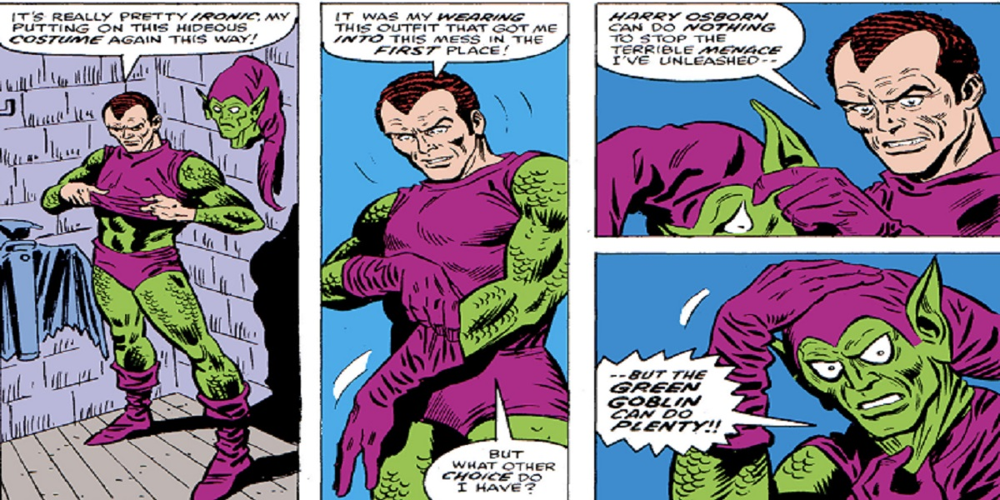

<h1>Memoria del proyecto bootstrap - 1º DAM/DAW</h1>
<h2>Spide-man - A tribute site</h2>
<h2>Indice</h2>
<ul>
  <li><a href="#introduccion">Introducción</a></li>
  <li><a href="#motivacion">Motivación</a></li>
  <li><a href="#estructura">Estructura</a></li>
  <li><a href="#estilo">Estilo</a></li>
</ul>

<h2 id="introduccion">Introducción</h2>

Trabajo realizado en clase por: Juan Cid Benítez

Proyecto de web "bootstrap" de 2ª evaluación de Lenguajes de Marcas

Febrero de 2024 

Licencia CC-BY

<h2 id="motivacion">Motivación</h2>

El tema lo he elegido porque me parece una muy buena películas y sus cómics también son muy buenos, por lo que me ofrece también muchas cosas sobre la de hablar.

<h2 id="estructura">Estructura</h2>

La web está dividida en  6 secciones:

<ul>
  <li>Barra de navegación</li>
  <li>Hero</li>  
  <li>Introducción</li>
  <li>Orígenes</li>
  <li>Cómic</li>
  <li>Películas</li>
  <li>Protagonistas</li>
  <li>Contacto</li>
  <li>Footer</li>
  </ul>

<h3>Hero Section</h3>

He utilizado una imagen de fondo 2 fotos una para dispositivos como ordenardores que es la segunda foto, para tablets y móvil la primera imagen ya que la otra se cortaba. 
Sobre ella  he colocado un Call to Action en el cual pones 'Haz clic para salvar el mundo', porque pensaba que queda bien con mi página ya que es de Spider-Man. 

<h3>Introducción</h3>

He puesto un texto breve sobre la introducción de Spider-man, en el cual explico brevemente de lo que va.Y abajo he hecho carousel. 

<h3>Origen</h3>

He puesto basicamente lo que es el origen de Spider-Man, y le he añadido una foto abajo.

<h3>Cómic</h3>

Aquí he hecho algo parecido a lo de arriba lo único que he explidado sobre el cómic, de manera que la explicación la he puesto encima de la imagen

<h3>Películas</h3>

He puesto card, donde explico las películas de Spider-man, y lugo la disposición que he utilizado es de 4 en 4 cards en ordenador, en tablets un poco grandes 3 3 1 card para que no quedara apretadas, en talets normales o un poco más pequeña de 2 en 2 card y por último en móvil de 1 en 1 card..

<h3>Protagonistas</h3>

Aqí lo que he hecho básicamente es utilizar un accordion en el cual pongo los nombres los protagonistas y al pinchar te sale de lo que actua y una foto de el.

<h3>Contaco</h3>

Aquí pongo un apartado por si e usuario quiere contactarse conmigo, y lo que pongo es nombre, apellidos , email y un hueco para que escriba el email.

<h2 id="estilo">Estilo de la página</h2>
<h3>Paleta de colores</h3>

Body: gris

Wrapper: rojo

Textos normales: blanco

Títulos: Azul

<h3>Tipografías</h3>

Para los textos normales y titulos he puesto esta tipografía:sf-action-man.regular.ttf

Para los titulos de las cards he puesto esta tipografía:velcro.regular.ttf 

Para contactos he puesto esta tipografía:RobotoCondensed-Bold.ttf 

<h3>Imágenes</h3>

Las imagenes la he sacado de: 

4 fantasticos:https://www.comicverso.com/resena-de-comic-marvel-comics-library-spider-man-vol-1/

Amazing_Spider-Man_Vol_1_1:https://spider-man.fandom.com/es/wiki/Amazing_Spider-Man_Vol_1_1

backgroung: https:https://wall.alphacoders.com/big.php?i=1347144

ben:https://lafilmotecadevinny.wordpress.com/2012/09/24/hablemos-de-the-amazing-spider-man-parte-1-de-3/cliff-robertson/

Card1:https://www.tonica.la/spot/Sam-Raimi-jugo-papel-clave-en-rumores-de-regreso-de-actores-para-Spider-Man-3-20201220-0007.html

Card2:https://sincroguia-tv.expansion.com/peliculas/spiderman-2--23z9-SPA

Card3https://www.filmaffinity.com/es/movieimage.php?imageId=818510935:

Card4:https://www.hobbyconsolas.com/reviews/amazing-spider-man-2012-critica-doble-68040

Card5:https://prensa.disney.es/noticias/the-amazing-spider-man-2-el-poder-de-electro-2014-llega-a-disney+-en-espana

Card6: https://prensa.disney.es/noticias/the-amazing-spider-man-2-el-poder-de-electro-2014-llega-a-disney+-en-espana

Card7: https://www.colombia.com/cine/noticias/spider-man-far-from-home-estreno-disney-plus-netflix-marvel-studios-365026

Card8:https://www.reddit.com/r/marvelstudios/comments/psnbdb/spiderman_no_way_home_landscape_poster_i_hope_you/?rdt=42502 

Comic Spider:https://sputniknews.lat/20110309/148488414.html

Favicon:https://www.pinterest.es/pin/832884524846903677/

hero-movil:https://es.vecteezy.com/arte-vectorial/25774874-hombre-arana-logo-rojo-antecedentes

james:https://www.sdpnoticias.com/geek/quien-es-el-duende-verde-villano-que-aparece-en-spider-man-no-way-home/ 

Mary Jane: https://consent.yahoo.com/v2/collectConsent?sessionId=3_cc-session_4683d4e0-b093-486f-bfc5-bc799797863d

logo:https://ar.pinterest.com/pin/64880050874709699/

mary:https://aminoapps.com/c/comics-es/page/blog/la-nueva-tia-may/1jei_6udRp2PzDbM51G5EXnd743qa5x

osborn:https://www.20minutos.es/cinemania/noticias/spoilers-spider-man-no-way-home-el-meme-de-norman-osborn-que-nos-han-colado-en-la-pelicula-4932009/

spider:https://www.etsy.com/es/listing/949869306/marvel-comics-spiderman-comic-paneles

Spider2:https://www.cinemascomics.com/perder-spider-man-seria-un-desastre-para-las-peliculas-de-marvel/

Spider3:https://www.pinterest.es/pin/389842911466267114/

Spider4:https://www.etsy.com/es/listing/204324245/marco-spiderman-spiderman-imprimir

Peter Parker:https://www.rtve.es/television/20230827/spiderman-tom-holland-andrew-garfield-tobey-maguire-actores-marvel-multiverso-mcu-peter-parker/2236623.shtml

<ul>
  <li>Barra de navegación: tomada de bootstrap.</li>

</ul>
